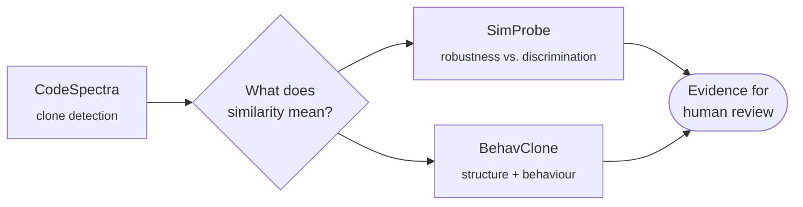

 

 

### Code similarity has a trade-off nobody mentions

*Make a comparison robust to refactoring, and unrelated programs start looking identical too.*
*I build controlled experiments to measure exactly where that line is.*

 

---

## Projects

<table>
<tr>
<td width="33%" valign="top">

### SimProbe
`experimental research`

Controlled experiments on the **robustness vs. discrimination** trade-off of similarity representations.

Identifier renaming · method reordering · class splitting · control similarity

[**View repositories →**](https://github.com/maria-habib17?tab=repositories)

</td>
<td width="33%" valign="top">

### BehavClone
`research prototype`

Whole-submission code comparison that keeps **structural, cohort-relative and behavioural evidence separate** instead of one plagiarism score.

JPlag 6.3.0 baseline · open negative results

[**View on GitHub →**](https://github.com/maria-habib17/behavclone)

</td>
<td width="33%" valign="top">

### CodeSpectra
`final-year project`

Academic clone detection across lexical, structural and semantic similarity of student programs (Type-1 to Type-4).

[**Read the article →**](https://blog.ptidej.net/codespectra-the-illusion-of-easy-coding-why-ai-still-demands-effort/)

</td>
</tr>
</table>

 

> [!NOTE]
> **Latest finding (BehavClone, synthetic cohort of 16 submissions, 120 pairs):**
> 24/24 related pairs reached normalized similarity 1.0, but so did 48/96 unrelated control pairs.
> Normalization recovered similarity across transformations, and on this fixture it also removed information needed to tell independent programs apart.
> I'm publishing the failure and designing the next experiment around it.

---

## How the work connects

---

## Current lab status

<table>
<tr>
<td width="50%" valign="top">

**SimProbe / experiment-003**

| Stage | Status |
|---|---|
| Protocol | 🔒 frozen |
| Fixture specification | 🔒 frozen |
| 12 base programs | ✅ pass |
| Behaviour tests | ✅ 36 / 36 |
| Transformations | ⏭️ next |

</td>
<td width="50%" valign="top">

**What I care about**

The goal isn't another similarity score.

It's understanding **what information a score actually preserves**, from how code looks, to how it's structured, to how it behaves.

</td>
</tr>
</table>

---

## Stack

  

`AI4SE` · `Program Analysis` · `Code Similarity` · `Clone Detection` · `Empirical SE` · `Reproducibility`

---

## GitHub activity

 

---

### Let's talk about code similarity, program analysis or evaluation design

<i>From how code looks, to how it is structured, to how it behaves.</i>

